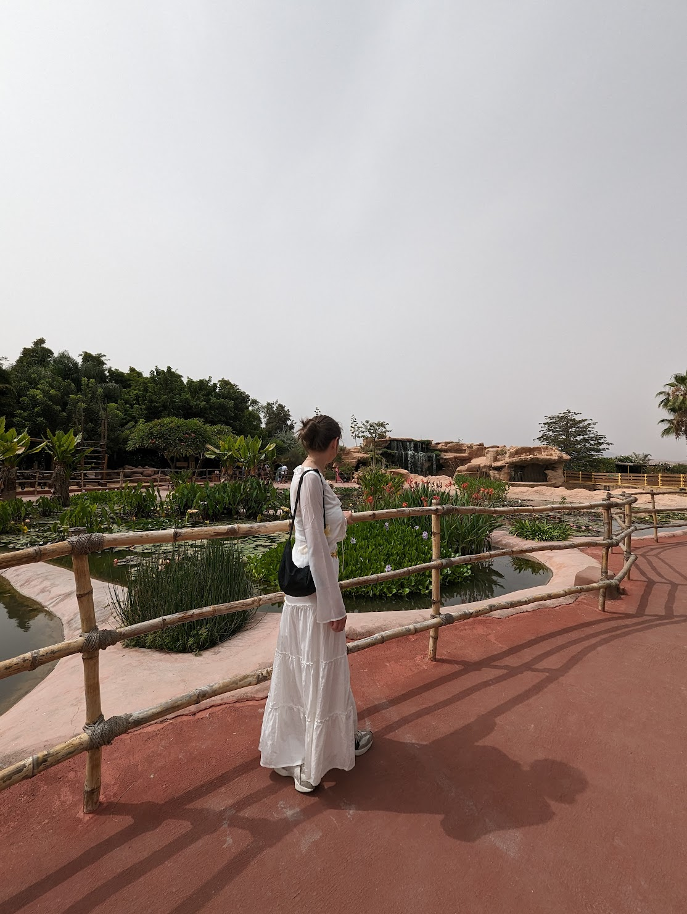

# profile.md
# Chloe's Coding Journey

## Why I am taking this class
I am taking this class to learn coding and expand my skills, particularly in web development and software engineering. I believe this will be a great opportunity to kickstart my career in tech.

## What I Love About Barcelona
I haven’t visited Barcelona yet, but I hope to explore:
- The beautiful architecture like La Sagrada Familia.
- The amazing beaches.
- The delicious food, especially tapas!

## My Professional Background
I have a background in **media and communication**, where I worked on various projects related to digital marketing and content creation. Now, I am excited to dive deeper into the world of **coding** and **software development**.

## My Previous Experience with Coding
I have limited experience with coding, having dabbled in HTML and CSS in the past. This class will be my first structured approach to learning **Python**, **JavaScript**, and other programming languages.

## Fun Facts About Me
- I love traveling and have visited Morocco and Paris recently!
- I am passionate about skincare and enjoy learning about new routines.
- I have a deep love for animals, especially dogs.

## Contact Me
Feel free to connect with me on [LinkedIn](www.linkedin.com/in/chloemooney99).

